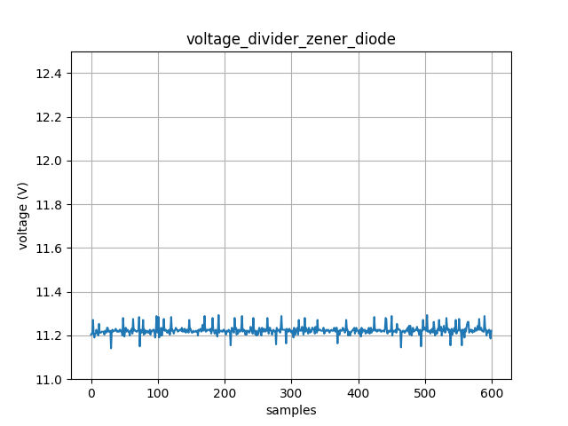
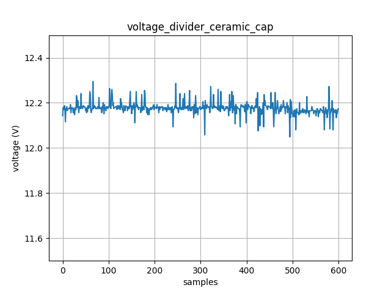
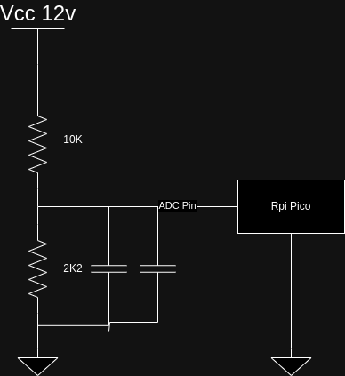
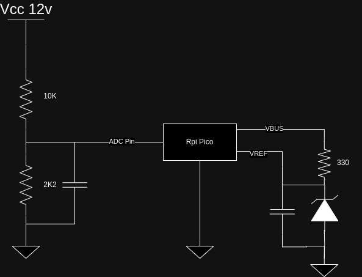
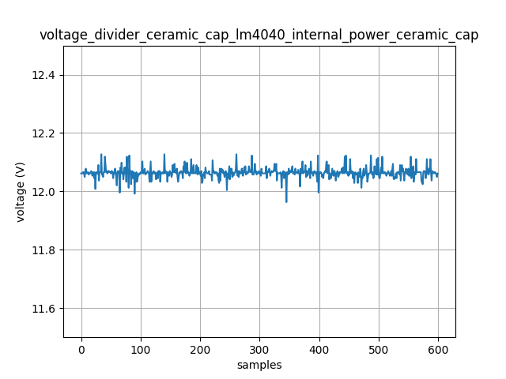
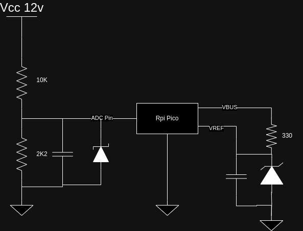
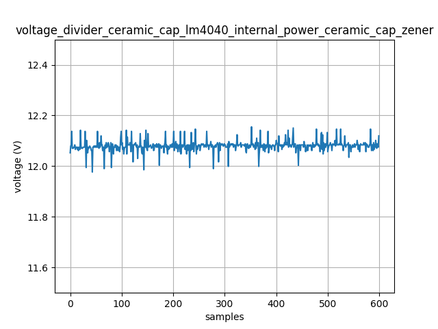

## RPiPico Voltmeter

---

Experiments with Raspberry Pi Pico ADC voltmeter

---

### Parts
| Part Name                      | Quantity |
|--------------------------------|:--------:|
| Raspberry Pi Pico              |    1     |
| 10K Ω resistor                 |    1     |
| 2.2K Ω resistor                |    1     |
| 330 Ω resistor                 |    1     |
| LM4040 voltage reference diode |    1     |
| 3.3V Zener diode               |    1     |
| 10uF ceramic capacitor         |    2     |

### Experiments
Series of experiments performed measuring 12V input voltage in order to find the best method to reduce ADC noise.
Input voltage is supplied through voltage divider to maintain voltage range safe for Pico ADC
in this case 1:6 ratio so 6V of input voltage == 1V on ADC Pin.

My conclusion is that the best results can be achieved by using a voltage reference diode (LM4040) in combination with ceramic capacitors,
although to get the most accurate readings it may be necessary to perform voltage measurements and set the 
voltage divider value (`VOLTAGE_DIVIDER_FACTOR`) for different voltage ranges.
Zener diode used for extra protection may affect voltage divider ratio, it can be checked and adjusted (if needed) 
with digital voltmeter.

#### Using internal reference voltage (ADC range 0V - 3.3V)

##### Voltage Divider

##### Voltage Divider + Zener diode

##### Voltage Divider + Ceramic Capacitor

##### Voltage Divider + 2x Ceramic Capacitor

#### Using external reference voltage (ADC range 0V - 3V)

##### Voltage Divider + Ceramic Capacitor + LM4040 + Ceramic Capacitor (The best results)

##### Voltage Divider + Ceramic Capacitor + LM4040 + Ceramic Capacitor + Zener diode

